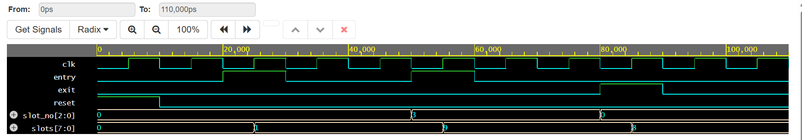

# Smart-Parking-Management-and-Slot-Monitoring-System-using-Verilog
# 🚗 Smart Parking Management and Slot Monitoring System using Verilog HDL

A digital hardware implementation of a **Smart Parking Management System** using **Verilog HDL**. The project models an **8-slot parking facility** where each parking slot is represented by one bit of an 8-bit occupancy register. The design supports real-time parking slot allocation and deallocation through simple entry and exit control signals.

---

## 📌 Project Overview

This project demonstrates the design and functional verification of a Smart Parking Management System using Register Transfer Level (RTL) design principles.

The system keeps track of parking slot occupancy using:

- Entry signal
- Exit signal
- 3-bit Slot Selection input
- 8-bit Slot Status Register

The design is fully synchronous and verified through simulation using a dedicated Verilog testbench.

---

## ✨ Features

- Supports **8 parking slots**
- Real-time occupancy monitoring
- Independent slot allocation
- Independent slot deallocation
- Active-high asynchronous reset
- Synchronous operation with clock
- Compact RTL implementation
- Easy to extend for larger parking systems

---

## 🏗️ System Architecture

### Inputs

| Signal | Width | Description |
|---------|------|-------------|
| clk | 1 | System Clock |
| reset | 1 | Active High Reset |
| entry | 1 | Vehicle Entry Signal |
| exit | 1 | Vehicle Exit Signal |
| slot_no | 3 | Parking Slot Number (0–7) |

### Output

| Signal | Width | Description |
|---------|------|-------------|
| slots | 8 | Occupancy Status of Parking Slots |

---

## ⚙️ Working Principle

Each parking slot corresponds to one bit in the `slots[7:0]` register.

- **0** → Slot is Vacant
- **1** → Slot is Occupied

### Entry Operation

When:

- `entry = 1`

the selected slot bit is set to **1**.

Example:

```
slot_no = 3

Before:
00000001

After:
00001001
```

---

### Exit Operation

When:

- `exit = 1`

the selected slot bit is cleared to **0**.

Example:

```
slot_no = 0

Before:
00001001

After:
00001000
```

---

### Reset Operation

When

```
reset = 1
```

all parking slots become vacant.

```
slots = 00000000
```

---

## 📂 Project Structure

```
Smart-Parking-System/
│
├── parking_system.v          # Verilog RTL Design
├── parking_system_tb.v       # Testbench
├── Waveform.png              # Simulation Output
├── Smart_Parking_Report.pdf  # Project Report
└── README.md
```

---

## 🧪 Simulation

The project was verified through functional simulation.

### Test Cases

✔ Reset functionality

✔ Vehicle entry into Slot 0

✔ Vehicle entry into Slot 3

✔ Vehicle exit from Slot 0

✔ Multiple slot occupancy

✔ Clock synchronization

---

## 📊 Simulation Result

Simulation confirms:

- Reset clears all slots.
- Entry correctly occupies the selected slot.
- Exit correctly frees the selected slot.
- Other slots remain unaffected.
- State updates occur only on the positive clock edge.

Example simulation waveform:

> Replace the image path below with your uploaded waveform image.

```markdown

```

---

## 🛠️ Tools Used

- Verilog HDL
- EDA Playground / Icarus Verilog
- GTKWave
- GitHub

---

## ▶️ How to Run

Compile the design

```bash
iverilog parking_system.v parking_system_tb.v -o parking
```

Run simulation

```bash
vvp parking
```

Generate waveform

```bash
gtkwave parking.vcd
```

---

## 📈 Future Enhancements

- FPGA implementation
- IR/Ultrasonic sensor integration
- Automatic slot allocation
- Seven-segment display
- LED status indicators
- UART communication
- IoT integration
- Mobile application support
- RFID-based authentication
- Parking fee calculation

---

## 📚 Applications

- Shopping malls
- Smart cities
- Airports
- Hospitals
- Office buildings
- Universities
- Apartment parking
- Multi-level parking systems

---

## 🎯 Learning Outcomes

This project demonstrates:

- Verilog HDL programming
- RTL Design
- Sequential Logic Design
- Register-based Architecture
- Functional Verification
- Testbench Development
- Digital System Simulation

---

## 👩‍💻 Author

**Krishnaveni Nyathani**

Bachelor of Technology (ECE)

Project: Smart Parking Management and Slot Monitoring System using Verilog HDL

---

## ⭐ GitHub

If you found this project useful, consider giving it a ⭐ on GitHub.
